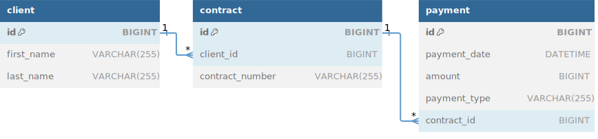

# Internal Payment Service
A Spring Boot application for managing and processing payments via an REST endpoint and relational database.

## Technologies used
- **Java 21**
- **Spring Boot 3.4.0**
- **Spring Data JPA**
- **PostgreSQL**
- **Flyway for database migrations**
- **JacksonFasterXML for XML serialization**
- **OpenCSV for CSV serialization**
- **H2-embedded database for testing**
- **TestContainers for integration testing**
- **OpenAPI documentation with Swagger**

## Features
- Create a single payment.
- Upload and process multiple payments from a file (csv or xml).
- Retrieve payments by contract number.

## Requirements
To run this application, you need:
- **Java 21**
- **Maven 3.9 for Spring boot 3+**
- **Docker** (optional, for running PostgreSQL via Docker Compose)

## How to Run
1. **Clone the repository**
   ```bash
   git clone <repository-url>
   cd internal-payment-service
2. **Run the application**
   ```bash
   mvn spring-boot:run -Dspring-boot.run.profiles=local
3. #### **Optional: Disable Docker Integration**
   By default, the application uses Docker to spin up a PostgreSQL container. This configuration is managed using Docker Compose.
   If you prefer not to use Docker: 
   * Set docker-compose.enabled=false in the application-local.yml file. 
   * Update the database connection variables in application-local.yml with your own PostgreSQL database details (e.g., url, username, password).

## How to Try Out the Application
After running the application, you can test its functionality using Swagger or cURL commands. The database has been pre-seeded with a client and contract with the contract number 12345.

#### Using Swagger
Open your browser and navigate to the Swagger UI at: http://localhost:8080/swagger-ui.html

#### Using cURL Commands

   * Create a Single Payment 
      ```bash
     curl -X POST "http://localhost:8080/api/v1/payments" \
      -H "Content-Type: application/json" \
      -d '{
      "paymentDate": "2024-12-09",
      "amount": 100.00,
      "paymentType": "INCOMING",
      "contractNumber": "12345"
      }'
   * Retrieve Payments by Contract Number
      ```bash
      curl -X GET "http://localhost:8080/api/v1/payments?contractNumber=12345" \
      -H "Accept: application/json"
   * Upload and Process Payments from a File
      ```bash 
      curl -X POST "http://localhost:8080/api/v1/payments/upload" \
      -H "Content-Type: multipart/form-data" \
      -F "file=@path/to/payments.csv"


## ER diagram
 

## Domain Questions for Stakeholders
#### Domain model definitions:
* What constitutes a client? Are clients limited to private individuals, or can they also be companies? Is there support for both types?
* What exactly is a contract in this context? For example, is it a loan agreement where the bank facilitates payments by sending outgoing money to the client and receiving incoming payments?
* Can a client have multiple contracts?
* Can a single contract involve multiple clients, such as in joint accounts or co-signed agreements?
* Amount is specified in the payment but should currency not be specified? Is the payment always in SEK?
* What is considered a duplicate payment?

#### Business validation for Payment Processing:
* Are there any weekly or daily payment limits for a client that we need to check?
* Do we need to check available balances for outgoing payments?
* How do we handle the timezone of the payment date?
* How can we validate that the provided contract number is valid, does it have to be numerical 5 digits?
* Is the CSV files supposed to have spaces, as shown in the example?

#### Entity Validation:
* How do we verify the existence of clients, payments, and contracts? Is this handled externally, or does our system need to call another service to validate these entities?

#### Error Handling for Batch Files:
* If a batch file contains an invalid or corrupted row, should the system skip that row and process the rest of the file? Or should the entire file processing be stopped?
* How do we handle empty files, throw exception or dont process?

#### AAA (Authentication, Authorization, Accounting) :
* Will the back-office personnel using this application need to log in and authenticate themselves?
* Can every staff member perform every action, will there be specific roles or permissions to restrict certain actions?
* Do we need to log and audit actions taken within the system, such as file uploads or payment entries? If so, what level of detail is required?
